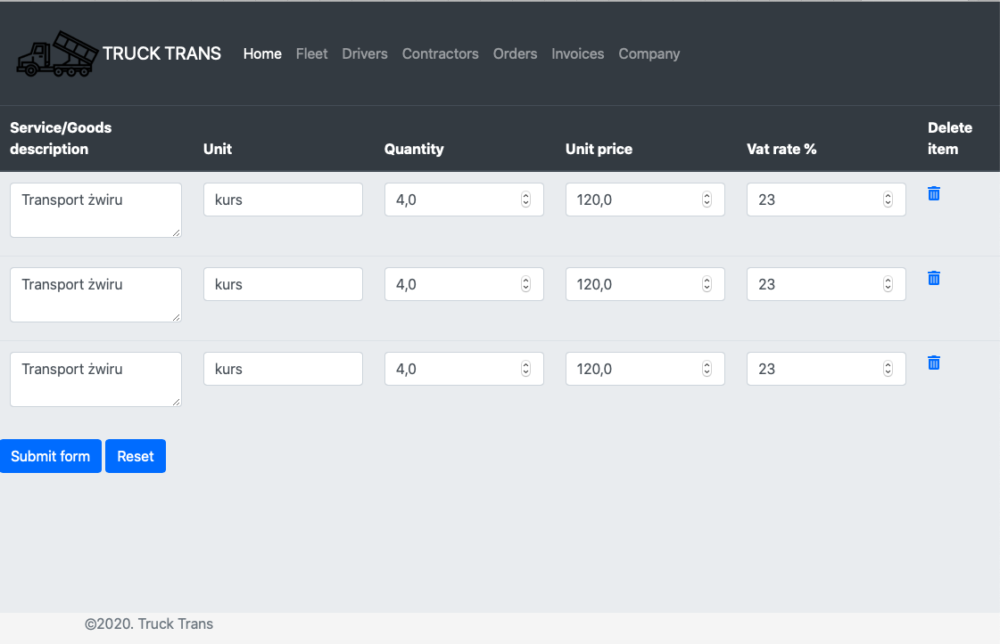
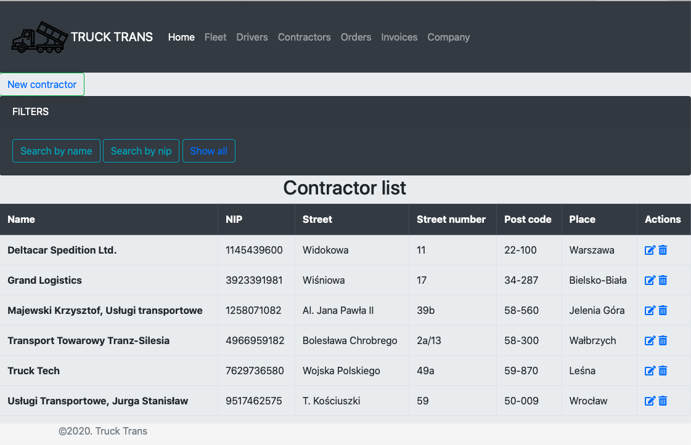
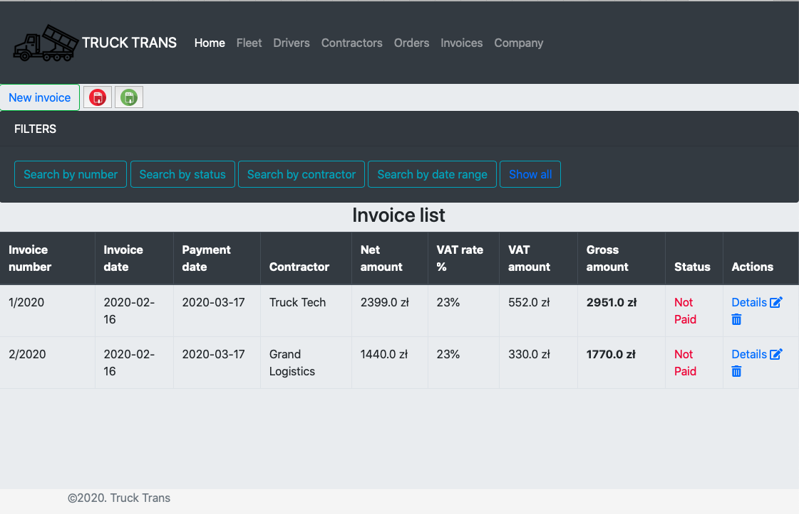

# Trucktrans

TRUCK TRANS is a simple trucking company management system. 

Used technologies:

- Java
- Thymeleaf
- HTML
- CSS
- Bootstrap 4
- JavaScript
- Spring boot
- Hibernate
- MySQL

Features:
With this simple application you are able to manage your:
- fleet
- drivers
- contractors
- invoices and orders
by adding, editing removing or viewing the lists and filtering the data.

Screenshots:

